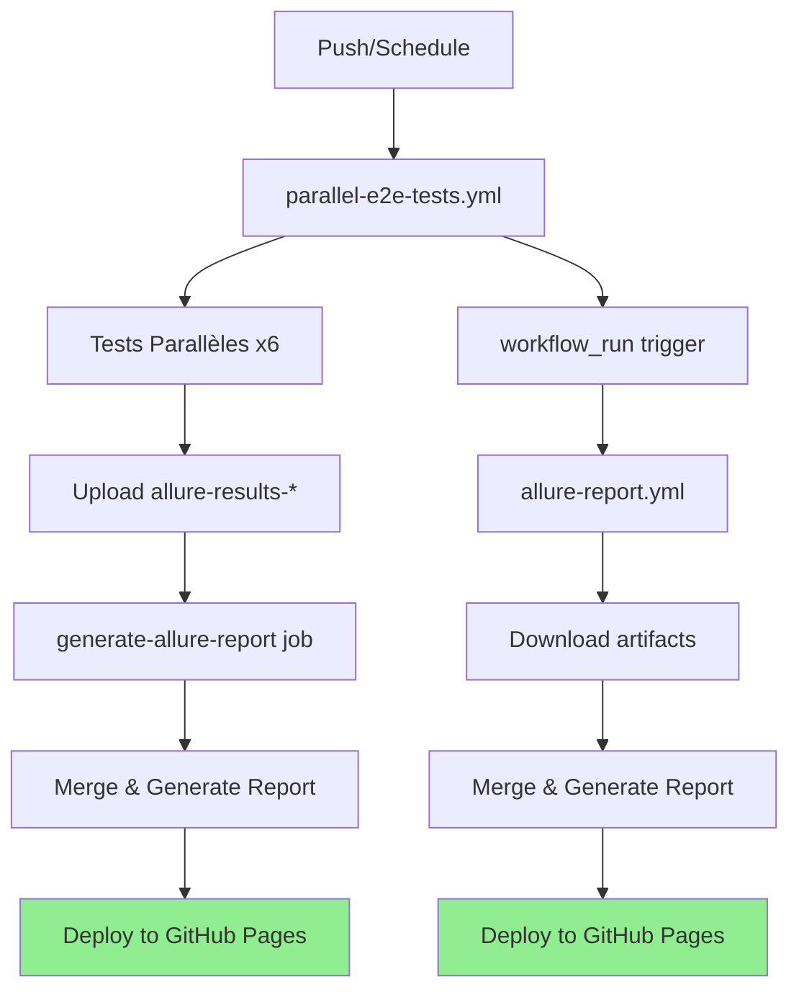

# 📊 Allure Report Workflows

## Vue d'ensemble

Le projet utilise **deux workflows GitHub Actions** pour générer et publier les rapports Allure :

### 1️⃣ **Workflow Principal : `parallel-e2e-tests.yml`**
- **Déclenchement** : Push sur `main`, workflow_dispatch, ou schedule quotidien
- **Rôle** : Exécute les tests E2E Playwright en parallèle (6 suites)
- **Actions** :
  - Configure un cluster Kubernetes (Kind)
  - Déploie l'infrastructure (PostgreSQL, API, Frontend)
  - Exécute les tests avec le reporter Allure
  - Upload les résultats Allure de chaque suite
  - Génère un rapport consolidé
  - Publie le rapport sur GitHub Pages (si branche `main`)

### 2️⃣ **Workflow Secondaire : `allure-report.yml`** (NOUVEAU)
- **Déclenchement** : Automatique après `parallel-e2e-tests.yml`
- **Rôle** : Publication alternative/backup du rapport Allure
- **Actions** :
  - Récupère les artefacts du workflow principal
  - Merge tous les résultats Allure
  - Génère le rapport
  - Publie sur GitHub Pages

---

## 🔄 Architecture des Workflows



---

## 📋 Configuration Détaillée

### Workflow Principal (`parallel-e2e-tests.yml`)

#### Tests en Parallèle
```yaml
strategy:
  matrix:
    test-suite:
      - { name: 'user-management', file: 'user-management.spec.ts' }
      - { name: 'api-integration', file: 'api-integration.spec.ts' }
      - { name: 'form-validation', file: 'form-validation.spec.ts' }
      - { name: 'ui-ux', file: 'ui-ux.spec.ts' }
      - { name: 'performance', file: 'performance.spec.ts' }
      - { name: 'accessibility', file: 'accessibility.spec.ts' }
```

#### Exécution des Tests
```yaml
- name: Run Tests - ${{ matrix.test-suite.name }}
  working-directory: frontend
  run: npx playwright test ${{ matrix.test-suite.file }} --reporter=list,allure-playwright
  continue-on-error: true
```

#### Upload des Résultats
```yaml
- name: Upload Allure results
  if: always()
  uses: actions/upload-artifact@v4
  with:
    name: allure-results-${{ matrix.test-suite.name }}
    path: frontend/allure-results/
    retention-days: 7
```

#### Job de Génération du Rapport
```yaml
generate-allure-report:
  needs: run-all-tests
  runs-on: ubuntu-latest
  if: always()
  steps:
    - name: Download all Allure results
      uses: actions/download-artifact@v4
      with:
        pattern: allure-results-*
        path: allure-results-temp/
    
    - name: Merge Allure results
      run: |
        mkdir -p allure-results
        find allure-results-temp -type f -name "*.json" -exec cp {} allure-results/ \;
    
    - name: Generate Allure report
      run: |
        npm install -g allure-commandline
        allure generate allure-results --clean -o allure-report
    
    - name: Deploy to GitHub Pages
      if: github.ref == 'refs/heads/main'
      uses: peaceiris/actions-gh-pages@v4
      with:
        github_token: ${{ secrets.GITHUB_TOKEN }}
        publish_dir: ./allure-report
        destination_dir: allure-report
```

---

### Workflow Secondaire (`allure-report.yml`)

#### Déclenchement par Workflow Run
```yaml
on:
  workflow_run:
    workflows: ["Parallel E2E Tests"]
    types:
      - completed
```

#### Download des Artefacts du Workflow Parent
```yaml
- name: Download all Allure results artifacts
  uses: actions/download-artifact@v4
  with:
    github-token: ${{ secrets.GITHUB_TOKEN }}
    run-id: ${{ github.event.workflow_run.id }}
    pattern: allure-results-*
    path: allure-results-temp/
```

#### Publication Conditionnelle
```yaml
- name: Deploy to GitHub Pages
  if: github.event.workflow_run.head_branch == 'main'
  uses: peaceiris/actions-gh-pages@v4
  with:
    github_token: ${{ secrets.GITHUB_TOKEN }}
    publish_dir: ./allure-report
    destination_dir: allure-report
```

---

## 🌐 Accès aux Rapports

### Option 1 : Rapport en Ligne (GitHub Pages)
**URL** : `https://<owner>.github.io/<repo>/allure-report/`

**Exemple** : https://otshudi-n-koy.github.io/mini-api-ts/allure-report/

**Disponible** :
- ✅ Après chaque exécution sur la branche `main`
- ✅ Mise à jour automatique
- ✅ Accessible publiquement (si repo public)

### Option 2 : Téléchargement d'Artefact

#### Via l'interface GitHub
1. Aller sur **Actions** → Workflow run
2. Section **Artifacts**
3. Télécharger `allure-report` ou `allure-report-published`
4. Extraire et ouvrir `index.html`

#### Via GitHub CLI
```bash
# Lister les artefacts
gh run list --workflow=parallel-e2e-tests.yml

# Télécharger un artefact
gh run download <run-id> -n allure-report

# Ouvrir le rapport
npx allure open allure-report
```

### Option 3 : Génération Locale
```bash
cd frontend
npm run test:allure           # Exécuter les tests
npm run allure:generate       # Générer le rapport
npm run allure:open           # Ouvrir dans le navigateur
```

---

## 🔧 Troubleshooting

### Problème : Les artefacts ne sont pas trouvés

**Cause** : Le workflow `allure-report.yml` s'exécute avant que les artefacts soient disponibles

**Solution** : Utiliser `actions/download-artifact@v4` avec `run-id` :
```yaml
- uses: actions/download-artifact@v4
  with:
    github-token: ${{ secrets.GITHUB_TOKEN }}
    run-id: ${{ github.event.workflow_run.id }}
```

### Problème : Le rapport est vide

**Causes possibles** :
1. Aucun test n'a généré de résultats Allure
2. Les fichiers JSON n'ont pas été mergés correctement

**Solution** :
```bash
# Vérifier le contenu des artefacts
find allure-results-temp -type f -name "*.json"

# Vérifier le merge
ls -la allure-results/
```

### Problème : GitHub Pages 404

**Cause** : GitHub Pages n'est pas activé ou mal configuré

**Solution** :
1. Aller sur **Settings** → **Pages**
2. Source : **Deploy from a branch**
3. Branch : `gh-pages` / `(root)`
4. Attendre 2-3 minutes après le premier déploiement

### Problème : Permissions insuffisantes

**Erreur** : `Error: Resource not accessible by integration`

**Solution** : Ajouter les permissions dans le workflow
```yaml
permissions:
  contents: write
  pages: write
  id-token: write
```

---

## 📊 Comparaison des Deux Workflows

| Aspect | `parallel-e2e-tests.yml` | `allure-report.yml` |
|--------|-------------------------|---------------------|
| **Déclenchement** | Manuel, Push, Schedule | Après workflow principal |
| **Exécution des tests** | ✅ Oui | ❌ Non |
| **Génération rapport** | ✅ Oui | ✅ Oui |
| **Publication Pages** | ✅ Oui (main) | ✅ Oui (main) |
| **Durée** | ~15-20 min | ~2-3 min |
| **Use case** | Exécution complète | Publication rapide |

---

## 🎯 Quand Utiliser Chaque Workflow ?

### Utiliser `parallel-e2e-tests.yml` :
- ✅ Tests complets avec infrastructure Kubernetes
- ✅ Validation avant merge
- ✅ Schedule quotidien
- ✅ Déploiement production

### Utiliser `allure-report.yml` :
- ✅ Re-publication du rapport sans réexécuter les tests
- ✅ Backup en cas d'échec de publication dans le workflow principal
- ✅ Mise à jour du rapport avec des données historiques

---

## 🚀 Best Practices

### 1. Rétention des Artefacts
```yaml
retention-days: 7   # Pour allure-results (temporaire)
retention-days: 30  # Pour allure-report (archive)
```

### 2. Conditionnels de Publication
```yaml
if: github.ref == 'refs/heads/main'  # Workflow principal
if: github.event.workflow_run.head_branch == 'main'  # Workflow secondaire
```

### 3. Gestion des Échecs
```yaml
continue-on-error: true  # Pour les tests
if: always()             # Pour l'upload d'artefacts
```

### 4. Nommage des Artefacts
```yaml
# Unique par suite
name: allure-results-${{ matrix.test-suite.name }}

# Rapport final
name: allure-report
```

---

## 📚 Ressources

- [Allure Documentation](https://docs.qameta.io/allure/)
- [Playwright Allure Reporter](https://www.npmjs.com/package/allure-playwright)
- [GitHub Actions - workflow_run](https://docs.github.com/en/actions/using-workflows/events-that-trigger-workflows#workflow_run)
- [peaceiris/actions-gh-pages](https://github.com/peaceiris/actions-gh-pages)

---

## ✅ Checklist de Mise en Place

- [x] Installer `allure-playwright` dans `frontend/package.json`
- [x] Configurer les reporters dans `playwright.config.ts`
- [x] Ajouter les scripts npm pour Allure
- [x] Créer le workflow principal avec tests parallèles
- [x] Créer le workflow secondaire avec `workflow_run`
- [x] Configurer GitHub Pages (Settings → Pages → gh-pages)
- [x] Tester l'exécution complète du pipeline
- [x] Vérifier l'accès au rapport en ligne

---

**Date de création** : 6 décembre 2025  
**Dernière mise à jour** : 6 décembre 2025
